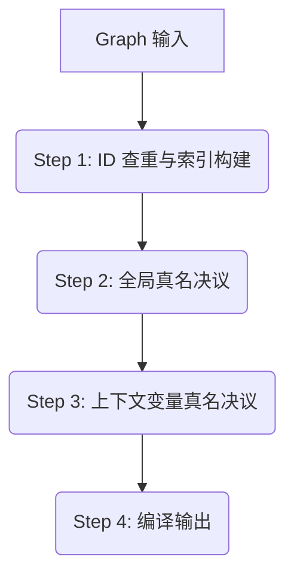

# 图表编译与导出

> 本文档描述 Destra "默认模式" 下将内部对象模型 (`Formula` DAG) 编译为 Desmos 外部数据格式 (`GraphState` JSON) 的设计方案。

这是整个框架的出口，负责将 JS 内存中构建的数学结构“降维”打击成 Desmos 能够理解的平面化指令列表。

## 内容目录

- [语法参考/](./语法参考/index.md) - Desmos 语法 & Expr DSL 语法参考，拆分为多个部分。
- [语法实现方案](./语法实现方案.md) - 基于 Chevrotain 的 Destra 表达式解析器实现方案。
- [上下文变量真名决议](./上下文变量真名决议.md) - 上下文变量真名决议的详细讨论和实现方案。

---

## 1. Destra 图表模型的顶级结构

### 1.1 Folder 与 Graph 定义

我们需要引入一个 **`Graph`** 对象作为编译和导出的核心容器。它不仅持有要导出的公式集合，还管理着图表的全局配置（如视口、坐标轴设置等）。

以及引入 `Folder` 类以代表 Desmos 的文件夹组织结构（注：Desmos 不支持嵌套文件夹）。

```typescript
import { Formula } from "./formula/base";

interface FolderInput {
    title: string;
    children: Formula[];
    options?: {
        collapsed?: boolean; // 初始是否折叠
        hidden?: boolean;   // 文件夹是否隐藏
        id?: string;        // 可选：用户指定稳定 ID，否则自动生成。这里的 ID 是 Desmos Row ID。
    };
}

export class Folder {
    constructor(input: FolderInput) {...}
}

interface GraphSettings {
    // 视口设置，支持数字或表达式（如果 Desmos 支持动态视口）
    viewport?: { 
        xmin: number | Formula; 
        xmax: number | Formula; 
        ymin: number | Formula; 
        ymax: number | Formula; 
    };
    // 坐标轴设置
    xAxisArrowMode?: "NONE" | "POSITIVE" | "BOTH";
    yAxisArrowMode?: "NONE" | "POSITIVE" | "BOTH";
    showGrid?: boolean;
    // ... 其他 Desmos Graph Settings
}

type RootItem = Formula | Folder;

interface Ticker {
    minStep?: NumericStyleValue;
    handler?: ActionStyleValue;
    playing?: boolean;
    open?: boolean;
    secret?: boolean;
}

interface GraphInput {
    root: RootItem[];
    ticker?: Ticker;
    settings?: GraphSettings;
}

export class Graph {
    constructor(input: GraphInput) {...}

    /**
     * 导出为 Desmos State JSON
     */
    export(): DesmosState {
        // ... 调用编译流程
    }
}
```

### 1.2 使用方式

用户可以通过两种方式导出图表：

1.  **JS API**: 在脚本中直接调用 `graph.export()` 获取 JSON 对象。
2.  **Vite 构建**: 在模块层面 `export` 一个 `Graph` 实例，配套的 Vite 插件会识别该导出并自动构建 Desmos 页面。

```javascript
// example.js
import { expr, Graph, Folder } from "@destra/core";

const a = expl`1 in 0::10`.id('a');
const b = expl`1 in 0::10`.id('b');
const ellipse = expr`x^2/${a}^2 + y^2/${b}^2 = 1`;

export default new Graph({
    root: [
        new Folder({
            title: "My Folder", 
            children: [
                a, 
                b,
            ],
        }),
        ellipse,
    ],
    settings: {
        showGrid: false,
    }
});
```

## 2. 编译流程

编译过程被划分为以下四个有序步骤。设计原则是**"错误前置"**：所有可能导致失败的检查（如 ID 冲突等）都应在前面几个步骤中完成，以尽可能 fast fail，进入后续步骤之后过程不再会失败。

由于我们切换到了创建时即时解析 AST 的方案，所有 AST 数据已经预备就绪，位于每个 Formula 对象的 `getState(formula).ast.ast` 属性中。



### Step 1: ID 查重与索引构建 (ID Registry & Collision Check)

检查所有表达式对象及文件夹的 ID 是否冲突，并构建索引表：ID-公式表，公式-文件夹表，可供后续步骤使用。

1.  **建立ID-公式表**: 建立一张 `Map<string, Formula>` 表，用于确保每个 ID 只有唯一 Expl 公式使用。
2.  **建立公式-文件夹表**: 建立这些表，确保每个公式要么只属于唯一 Folder，要么出现在 desmos 公式列表顶级：
    *   一张 `Map<Formula, Folder>` 表，用于记录公式所属的文件夹。
    *   一个用于记录所有直接出现在 Graph.roots 的“顶级归属”公式集合 `Set<Formula>`；
        *    一个公式如果出现为 destra Graph 对象的 root entry，那么就是显式指定它出现在 desmos 的顶级，此时它不能再被放置到任何 Folder 中——否则需要报错。这样可以确保用户的图表结构逻辑清晰。
    *   以及一个用于记录依赖型公式的“隐式顶级归属”公式集合 `Set<Formula>`；
        *   对于作为依赖上游、被自动收集但未显式放置在 Graph.roots 或其中某个文件夹的“依赖型”公式，目前我们对它们的处理方式是：它们默认不属于任何 Folder，而且需要在公式列表置顶，因此把它们加入这个集合。其实加入这个集合也方便我们未来可能会调整对这些依赖型公式的处理方式。
3.  **遍历时：归属记录 & 归属冲突检查**: 
    *   从 Grpah.roots 出发，递归按照依赖关系遍历。把“隐式顶级归属”集合当作“未知归属”集合用。
    *   如果遇到公式直接作为 root item，则加入“顶级归属”集合。如果它已经在“未知归属”集合中，则从“未知归属”集合中移除。如果它已经出现在公式-文件夹表，则报错。
    *   如果遇到公式作为文件夹的 child，则加入公式-文件夹表。如果它已经在“未知归属”集合中，则从“未知归属”集合中移除。如果它已经出现在“顶级归属”集合或者出现在其他文件夹中，则报错。
    *   递归遍历其依赖，依赖如果没有已经在“顶级归属”集合或者“公式-文件夹”表中，则默认先加入“未知归属”集合。
    *   最后留下的“未知归属”集合，即为“隐式顶级归属”集合。
4.  **遍历时：ID 记录 & ID 冲突检查**: 
    *   如果发现两个不同对象拥有相同 ID，则报错。
    *   如果发现对象 ID 为空 (undefined/null/empty string)，则报错。（一般用户会使用创作形式，即使未手动调用 `.id()`，系统也应自动生成 ID，因此最终编译时遇到空 ID 属于异常状态）。

### Step 2: 全局真名决议 (Realname Resolution)

基于 Step 1 的 ID 表，确定每个公式在 Desmos 中的最终变量名 (Realname)。

构建一个全局真名表：`Map<string, Formula>`，记录 Expl 公式-决议真名的关系，供后续步骤使用。

我们围绕三层命名系统的设计实际上形成了不同的命名优先级，所以需要分批优先命名。优先级为：

1. 使用 `.realname()` 设置的真名。
2. 使用 `.id()` 设置的显式 ID。
3. 预处理器自动生成的、通过 `.id(..., true)` 设置的隐式 ID。

处理流程：

1.  **优先级分类收集**:
    *   创建 3 个集合，分别收集每个适用于不同优先级的公式。
2.  **初步转换 - "语义核心置顶 + 路径倒序"**:
    Desmos 的变量名有严格限制（单字符主名 + 可选下标）。为了在严格限制下保持 ID 的可读性，采用以下转换算法：
    假设 ID 为 `path.t_o._KEY` (以 `.` 分割)
    *   **去除下划线**：如果 ID 中每段里包含下划线，则清洗/去除下划线。ID 变为 `path.to.KEY`。
    *   **Head (主字符)**: 为 ID 末段 `KEY` 的首字母。例外是，如果 `KEY` 是希腊字母全拼 (即 alias, 如 `alpha`)，则主字符为该希腊字母的 Latex 指令 (如 `\alpha`)。
    *   **Body (下标前缀)**: `KEY` 的剩余部分。
    *   **Qualifiers (下标后缀)**: 将 ID 的路径部分各段 (`path`, `to`) **倒序**排列，并将各段首字母大写（尽量转换为驼峰命名，但如果用户乱写我们也没办法x）。
    *   **结果**: `Head_{Body}{Qualifiers}`。
    *   **示例**: 
        *   `path.to.KEY` -> `K_{EYToPath}`。
        *   `scene_levelA.portal_0.pos.x` -> `x_{PosPortal0SceneLevelA}`。
         
    *   注：如果设置了 realname 则跳过初始转换。
3.  **分批处理冲突**: 
    检查初步转换后的名称是否与 Desmos 内置关键词（如 `x`, `y`, `sin`）或其他已决议名称冲突。由于 Step 1 已经保证了 ID 唯一，这里的冲突主要来自初步转换后的命名空间压缩。此时分批逐个进行**自动重命名**。
    *   按照优先级依次处理第 1-3 批。在每一批里依次遍历每个公式，遇到与 Desmos 内置关键词或前面已分配名称冲突时，采用添加数字后缀的方式，递增尝试直到不冲突为止。
    *   重命名冲突的方案：**数字增量策略**。
        1.  如果目标名称 `Name` 已存在，尝试在下标末尾追加数字 `2`，即生成 `Name` -> `Name2` (如果原名无下标则新建下标，如果原名有下标则追加在下标内容最后)。
        2.  如果 `Name2` 也冲突，则尝试 `Name3`，以此类推，直到找到未被占用的名称。
        3.  由于 ID 唯一性的保证，这种冲突仅源于命名空间的压缩，通常只会产生极小的数字后缀，在保证唯一性的同时最大程度保留可读性。
*   注：
    *    在 Desmos Latex 中，如果下标包含多个字符，必须用花括号包裹。即 `x_2` 可以写成 `x_2`，但 `x_{10}` 必须写成 `x_{10}`。为了统一，我们建议生成的后缀始终在花括号内，如果没有花括号则始终创建新的花括号。例如：`t` -> `t_{2}`，`v_{al}` -> `v_{al2}`。

### Step 3: 上下文变量真名决议 (Context Variable Realname Resolution)

Destra 需要支持在不同的作用域语句表达式中使用相同的上下文变量名，并自动解决冲突重命名为不同的真名。同时这一步位于全局真名决议之后，也符合我们的直觉：上下文变量名的真名决议优先级要比前面全局变量的三个优先级都低，不能为了上下文变量名而调整全局变量名，但是为了不与全局变量名冲突而调整上下文变量名是合理的。

在 Desmos 里上下文语句的作用域覆盖它的整个身体表达式的上游依赖树。只要在它的身体表达式的依赖树范围内，引用该 Desmos 上下文变量名就必定会触发上下文补全的语义。因此，当表达式树的一部分同时位于两个上下文语句的作用域（嵌套的）时，如果这两个上下文语句具有相同的变量名，就会出现一些很难建模的行为，一个变量会覆盖其他变量，甚至还会覆盖全局变量：更内部的强型(with)上下文变量 > 更外部的强型(with)上下文变量 > 全局变量 > 更内部的弱型(其他)上下文变量 > 更外部的弱型(其他)上下文变量。

但是在 Destra 里，用户组织的 JS 表达式结构，或者更具体地说用户选择将哪个上下文变量嵌入到哪个表达式中，是已经体现了用户的意图的；更何况默认模式是比较偏向于构建和工程化、而非完全的特性利用的。所以我们需要避免在 Destra 里建模、或者中介那些刚才提到的 Desmos 上下文变量名覆盖的特性（和优先级规则），而是要以我们/用户自己的、在 JS 里符合直觉地构建的这些逻辑结构为准，在 Desmos 里通过调整上下文变量命名、“避让冲突/碰撞”的方法来确保 JS 侧 / Destra 默认模式侧结构逻辑在 Desmos 里正确呈现，即使要以命名有概率被轻微调整为代价。同时因为 Desmos 原生上下文变量覆盖特性难以通过实验完全确定，且机制可能反直觉，因此我们宁可不利用任何 Desmos 原生的上下文变量覆盖特性，宁可在任何一处有冲突处都进行重命名/避让。

因此我们需要对上下文变量进行合理的重命名与冲突解决：只要两个（或多个）作用域有重叠、重叠区域有其中一个上下文语句的上下文变量的引用，并且该上下文变量的名称在两个以上作用域中出现（重名），就需要视为冲突而被重命名。

或者我们可以再收窄一下范围：只要上下文语句嵌套并存在重名变量时，无论在下文中是否存在对该变量的引用，都需要视为冲突而被重命名。

详见 [上下文变量真名决议](./上下文变量真名决议.md)。

### Step 4: 编译输出 (Compilation)

这是"组装"阶段，将之前准备好的数据合并为最终结果。由于前置步骤已完成校验及解析，此步骤应一气呵成。

1.  **规范化 AST 生成**:
    
    由于 Desmos 和 Destra DSL 语法上的一些差异，我们需要在编译前对 AST 进行一些修改，例如补全乘号、补全小括号、展开各种语法糖等等。可能需要直接修改 AST 节点，也可能需要在原 AST 旁边重新生成一个新的规范化 AST。（先暂时采用后者？）

2.  **Latex 生成**:
    *   利用 Step 2 的 AST 和 Step 3 的 Realname Map，生成最终的 Latex 字符串。
    *   递归处理插值：将依赖对象的引用替换为其 Realname (for Expl) 或者其 Latex 代码 (for Expr)。这里 Latex 代码也应该被缓存到 state 里，方便一个 expr 对象被多次复用。
    *   处理上下文变量：局部变量（如 `For` 里的 `i`）直接使用其字面名，不进行全局决议。
3.  **Desmos Item 组装**:
    *   **Folder**: 为 Folder 对象分配 Desmos Row ID，生成 `{ type: 'folder', id: string, ... }`。
    *   **Formula**: 为 Formula 对象分配 Desmos Row ID，生成 `{ type: 'expression', id: string, latex: string, ... }`。
        *   如果该公式在 Step 1 中被标记为属于某文件夹，添加 `folderId` 属性。
    *   **样式组装**: 读取 `formula.style` 数据，通过映射函数转换为 Desmos 属性。（Destra Style 也包括了参数方程定义域、以及 click handler 等）
    *   **Slider 注入**: 读取 `Expl` 的 Slider 定义 (`min`, `max`, `step`)，转换为 Desmos 属性。
    *   Desmos Row ID 可以直接使用公式的 ID (或其 hash)，以保持稳定性。
4.  **JSON 构建**:
    *   生成包含 `version`, `randomSeed`, `graph`, `expressions` 的完整 JSON 对象。
