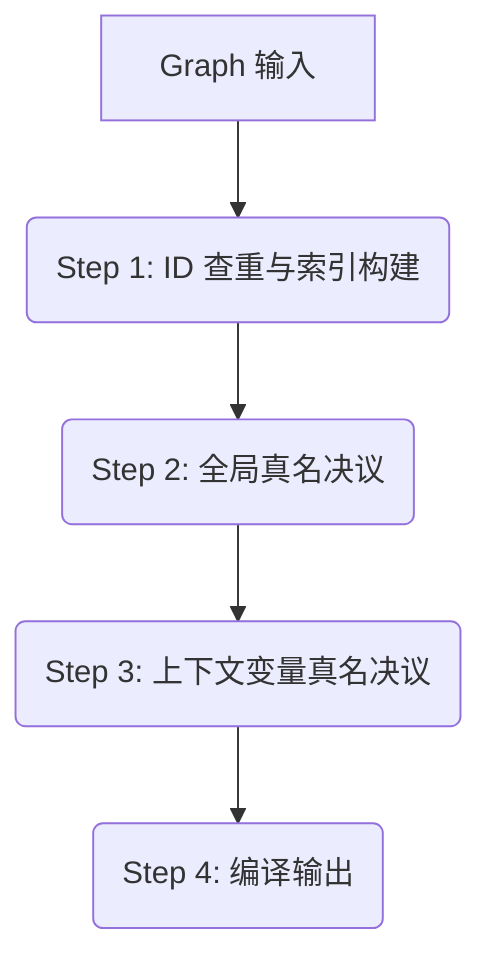

# 图表编译与导出

> 本文档描述 Destra "默认模式" 下将内部对象模型 (`Formula` DAG) 编译为 Desmos 外部数据格式 (`GraphState` JSON) 的设计方案。

这是整个框架的出口，负责将 JS 内存中构建的数学结构“降维”打击成 Desmos 能够理解的平面化指令列表。

## 内容目录

- [语法参考/](./语法参考/index.md) - Desmos 语法 & Expr DSL 语法参考，拆分为多个部分。
- [语法实现方案](./语法实现方案.md) - 基于 Chevrotain 的 Destra 表达式解析器实现方案。
- [上下文变量真名决议](./上下文变量真名决议.md) - 上下文变量真名决议的详细讨论和实现方案。

---

## 1. Destra 图表模型的顶级结构

### 1.1 Folder 与 Graph 定义

我们需要引入一个 **`Graph`** 对象作为编译和导出的核心容器。它不仅持有要导出的公式集合，还管理着图表的全局配置（如视口、坐标轴设置等）。

以及引入 `Folder` 类以代表 Desmos 的文件夹组织结构（注：Desmos 不支持嵌套文件夹）。

```typescript
import { Formula } from "./formula/base";

interface FolderInput {
    title: string;
    children: Formula[];
    options?: {
        collapsed?: boolean; // 初始是否折叠
        hidden?: boolean;   // 文件夹是否隐藏
        id?: string;        // 可选：用户指定稳定 ID，否则自动生成。这里的 ID 是 Desmos Row ID。
    };
}

export class Folder {
    constructor(input: FolderInput) {...}
}

interface GraphSettings {
    // 视口设置，支持数字或表达式（如果 Desmos 支持动态视口）
    viewport?: { 
        xmin: number | Formula; 
        xmax: number | Formula; 
        ymin: number | Formula; 
        ymax: number | Formula; 
    };
    // 坐标轴设置
    xAxisArrowMode?: "NONE" | "POSITIVE" | "BOTH";
    yAxisArrowMode?: "NONE" | "POSITIVE" | "BOTH";
    showGrid?: boolean;
    // ... 其他 Desmos Graph Settings
}

type RootItem = Formula | Folder;

interface Ticker {
    minStep?: NumericStyleValue;
    handler?: ActionStyleValue;
    playing?: boolean;
    open?: boolean;
    secret?: boolean;
}

interface GraphInput {
    root: RootItem[];
    ticker?: Ticker;
    settings?: GraphSettings;
}

export class Graph {
    constructor(input: GraphInput) {...}

    /**
     * 导出为 Desmos State JSON
     */
    export(): DesmosState {
        // ... 调用编译流程
    }
}
```

### 1.2 使用方式

用户可以通过两种方式导出图表：

1.  **JS API**: 在脚本中直接调用 `graph.export()` 获取 JSON 对象。
2.  **Vite 构建**: 在模块层面 `export` 一个 `Graph` 实例，配套的 Vite 插件会识别该导出并自动构建 Desmos 页面。

```javascript
// example.js
import { expr, Graph, Folder } from "@destra/core";

const a = expl`1 in 0::10`.id('a');
const b = expl`1 in 0::10`.id('b');
const ellipse = expr`x^2/${a}^2 + y^2/${b}^2 = 1`;

export default new Graph({
    root: [
        new Folder({
            title: "My Folder", 
            children: [
                a, 
                b,
            ],
        }),
        ellipse,
    ],
    settings: {
        showGrid: false,
    }
});
```

## 2. 编译流程

编译过程被划分为以下四个有序步骤。设计原则是**"错误前置"**：所有可能导致失败的检查（如 ID 冲突等）都应在前面几个步骤中完成，以尽可能 fast fail，进入后续步骤之后过程不再会失败。

为了在各步骤间高效共享数据，我们引入一个 **`CompileContext`** 对象，贯穿整个编译流程。

```typescript
interface CompileContext {
    // Step 1 产出
    idMap: Map<string, Formula>;            // ID -> Formula
    formulaToFolder: Map<Formula, Folder>;  // Formula -> Folder
    rootFormulas: Set<Formula>;             // 显式顶级公式
    implicitRootFormulas: Set<Formula>;     // 隐式顶级公式 (依赖型)
    
    // Step 2 产出
    globalRealnameMap: Map<Formula, string>; // Formula -> Global Realname
    globalUsedNames: Set<string>;            // 所有已占用的全局真名 (含 Desmos 关键字)

    // Step 3 产出
    scopeTree: ScopeTree;                    // 上下文作用域树
    ctxVarRealnameMap: Map<CtxVar, string>;  // CtxVar -> Realname
    astVarRealnameMap: Map<ASTNode, string>; // Internal AST Node -> Realname
}
```

### 被前移至创建时的工作

*   **AST解析**: 由于我们切换到了创建时即时解析 AST 的方案，所有 AST 数据已经预备就绪，位于每个 Formula 对象的 `getState(formula).ast.ast` 属性中。
*   **合法性检查**: 大部分合法性检查的工作被迁移至公式创建时即时计算，详见 [结构合法性检查](./结构合法性检查.md)。



### Step 1: ID 查重与索引构建 (ID Registry & Collision Check)

**输入**: `Graph` 对象
**输出**: 填充 `CompileContext` 的 `idMap`, `formulaToFolder`, `rootFormulas`, `implicitRootFormulas`, `ctxVarForceRealnameSet`

检查所有表达式对象及文件夹的 ID 是否冲突，并构建索引表：ID-公式表，公式-文件夹表，可供后续步骤使用。

1.  **建立ID-公式表**: 建立一张 `Map<string, Formula>` 表，用于确保每个 ID 只有唯一 Expl 公式使用。
2.  **建立公式-文件夹表**: 建立这些表，确保每个公式要么只属于唯一 Folder，要么出现在 desmos 公式列表顶级：
    *   一张 `Map<Formula, Folder>` 表，用于记录公式所属的文件夹。
    *   一个用于记录所有直接出现在 Graph.roots 的“顶级归属”公式集合 `Set<Formula>`；
        *    一个公式如果出现为 destra Graph 对象的 root entry，那么就是显式指定它出现在 desmos 的顶级，此时它不能再被放置到任何 Folder 中——否则需要报错。这样可以确保用户的图表结构逻辑清晰。
    *   以及一个用于记录依赖型公式的“隐式顶级归属”公式集合 `Set<Formula>`；
        *   对于作为依赖上游、被自动收集但未显式放置在 Graph.roots 或其中某个文件夹的“依赖型”公式，目前我们对它们的处理方式是：它们默认不属于任何 Folder，而且需要在公式列表置顶，因此把它们加入这个集合。其实加入这个集合也方便我们未来可能会调整对这些依赖型公式的处理方式。
3.  **遍历时：归属记录 & 归属冲突检查**: 
    *   从 Grpah.roots 出发，递归按照依赖关系遍历。把“隐式顶级归属”集合当作“未知归属”集合用。
    *   如果遇到公式直接作为 root item，则加入“顶级归属”集合。如果它已经在“未知归属”集合中，则从“未知归属”集合中移除。如果它已经出现在公式-文件夹表，则报错。
    *   如果遇到公式作为文件夹的 child，则加入公式-文件夹表。如果它已经在“未知归属”集合中，则从“未知归属”集合中移除。如果它已经出现在“顶级归属”集合或者出现在其他文件夹中，则报错。
    *   递归遍历其依赖，依赖如果没有已经在“顶级归属”集合或者“公式-文件夹”表中，则默认先加入“未知归属”集合。
    *   最后留下的“未知归属”集合，即为“隐式顶级归属”集合。
4.  **遍历时：ID 记录 & ID 冲突检查**: 
    *   如果发现两个不同对象拥有相同 ID，则报错。
    *   如果发现对象 ID 为空 (undefined/null/empty string)，则报错。（一般用户会使用创作形式，即使未手动调用 `.id()`，系统也应自动生成 ID，因此最终编译时遇到空 ID 属于异常状态）。
5.  **上下文结构合法性检查**: 确保图表的依赖结构符合 Destra 和 Desmos 的限制，拦截非法结构。
    *   我们总共需要检查以下这些条件：
        *  **CtxVar 逃逸检查**: 确保上下文变量只在其定义的作用域内被引用，防止从 Factory 作用域逃逸到全局或其他无关路径。
        *  **函数闭包检查**: 确保 `FuncExpl` 内部只引用自身的参数，不引用外部 CtxVar。
        *  **With 嵌套检查**: 确保 `With` 语句没有在内部 DSL 和跨 expr (内联表达式) 范围内发生非法嵌套。
        *  **定义自依赖检查**: 确保上下文变量的定义表达式不依赖同级变量。
    *   已确定在验证合法性时最佳算符是逐公式的"需求(Requirement)计算"，因此大部分合法性检查的工作已被迁移至公式创建时即时计算，Step 1.5 仅负责在最终各 root 入口处检查验收。
    *   详见 [结构合法性检查](./结构合法性检查.md)。
6.  **CtxVar 强制真名收集**: 提前收集所有 `CtxVar` 对象的强制真名，用于后续真名决议。

### Step 2: 全局真名决议 (Realname Resolution)

**输入**: `CompileContext` (主要使用 `idMap`, `ctxVarForceRealnameSet`)
**输出**: 填充 `CompileContext` 的 `globalRealnameMap`, `globalUsedNames`

基于 Step 1 的 ID 表，确定每个公式在 Desmos 中的最终变量名 (Realname)。这一步至关重要，因为后续的上下文变量必须避让这些全局真名。

构建一个全局真名表：`Map<Formula, string>`，记录 Expl 公式-决议真名的关系。
同时构建一个全局已用名集合：`Set<string>`，包含所有决议出的真名以及 Desmos 内置关键字（如 `x`, `y`, `sin` 等）。CtxVar 的强制真名也加入这个集合。CtxVar 的强制真名和 Expl 的强制真名之间也不能冲突，如果冲突需要报错。CtxVar 之间强制真名暂时可以重复，后续再检查是否在任意一条 Scope Node 链上重复。

我们围绕三层命名系统的设计实际上形成了不同的命名优先级，所以需要分批优先命名。优先级为：

1. 使用 `.realname()` 设置的真名。
2. 使用 `.id()` 设置的显式 ID。
3. 预处理器自动生成的、通过 `.id(..., true)` 设置的隐式 ID。

处理流程：

1.  **优先级分类收集**:
    *   创建 3 个集合，分别收集每个适用于不同优先级的公式。
2.  **初步转换 - "语义核心置顶 + 路径倒序"**:
    Desmos 的变量名有严格限制（单字符主名 + 可选下标）。为了在严格限制下保持 ID 的可读性，采用以下转换算法：
    假设 ID 为 `path.t_o._KEY` (以 `.` 分割)
    *   **去除下划线**：如果 ID 中每段里包含下划线，则清洗/去除下划线。ID 变为 `path.to.KEY`。
    *   **Head (主字符)**: 为 ID 末段 `KEY` 的首字母。例外是，如果 `KEY` 能检测到以希腊字母英文别名开头 (如 `alpha`)，则主字符定为该希腊字母的 Latex 指令 (如 `\alpha`)。
    *   **Body (下标前缀)**: `KEY` 的剩余部分。
    *   **Qualifiers (下标后缀)**: 将 ID 的路径部分各段 (`path`, `to`) **倒序**排列，并将各段首字母大写（尽量转换为驼峰命名，但如果用户乱写我们也没办法x）。
    *   **结果**: `Head_{Body}{Qualifiers}`。
    *   **示例**: 
        *   `path.to.KEY` -> `K_{EYToPath}`。
        *   `scene_levelA.portal_0.pos.x` -> `x_{PosPortal0SceneLevelA}`。
         
    *   注：如果设置了 realname 则跳过初始转换；但是也需要进行规范化处理，统一转换为带花括号形式 `t` -> `t_{2}`。
3.  **分批处理冲突**: 
    检查初步转换后的名称是否与 `globalUsedNames` (初始包含 Desmos 关键字) 冲突。由于 Step 1 已经保证了 ID 唯一，这里的冲突主要来自初步转换后的命名空间压缩。此时分批逐个进行**自动重命名**。
    *   按照优先级依次处理第 1-3 批。在每一批里依次遍历每个公式，遇到冲突时，采用添加数字后缀的方式，递增尝试直到不冲突为止。
    *   每确定一个真名，立即将其加入 `globalRealnameMap` 和 `globalUsedNames`。
    *   重命名冲突的方案：目前采用**数字增量策略**。
        1.  如果目标名称 `Name` 已存在，尝试在下标末尾追加数字 `2`，即生成 `Name` -> `Name2` (如果原名无下标则新建下标，如果原名有下标则追加在下标内容最后)。
        2.  如果 `Name2` 也冲突，则尝试 `Name3`，以此类推，直到找到未被占用的名称。
    *   注：我们生成的后缀始终在花括号内，例如：`t` -> `t_{2}`。

### Step 3: 上下文变量真名决议 (Context Variable Realname Resolution)

**输入**: `CompileContext` (主要使用 `globalUsedNames`)
**输出**: 填充 `CompileContext` 的 `scopeTree`, `ctxVarRealnameMap`, `astVarRealnameMap`

Destra 需要支持在不同的作用域语句表达式中使用相同的上下文变量名，并自动解决冲突重命名为不同的真名。这一步位于全局真名决议之后，因为上下文变量必须**无条件避让**全局变量名，以防止意外覆盖。

为了解决嵌套上下文和重名冲突问题，我们引入 **Scope DAG** 数据结构，构建一张只包含我们关心节点的精简版依赖图。

1.  **Scope DAG 构建**: 遍历图表依赖关系，构建一张包含所有“Factory 作用域”和“Internal DSL 作用域”的 DAG。
2.  自顶向下分配真名。在每个节点，首先继承父级已占用的名字和 `globalUsedNames` 作为“禁区”，然后分配本级变量名。如果发生冲突（无论是与全局变量，还是与父级上下文变量），则对本级变量进行重命名（数字增量）。

这确保了：
*   上下文变量永远避让全局变量。
*   内部上下文变量永远避让外部上下文变量（除非用户显式强制）。
*   同名变量在同一条 Scope Node 链上的不同嵌套层级会被自动区分（如 `i`, `i_{2}`），但如果完全不存在同一条 Scope Node 链，两个 Scope Node 之间同名变量可以重复。

详见 [上下文变量真名决议](./上下文变量真名决议.md)。

### Step 4: 编译输出 (Compilation)

**输入**: 完整的 `CompileContext`
**输出**: `DesmosState` JSON 对象

这是"组装"阶段，将 `CompileContext` 中的数据合并为最终结果。

1.  **Latex 生成**:
    *   利用 `globalRealnameMap` 和 `ctxVarRealnameMap`/`astVarRealnameMap`，生成最终的 Latex 字符串。
    *   递归处理插值：将依赖对象的引用替换为其 Realname (for Expl) 或者其 Latex 代码 (for Expr)。
    *   **规范化**: 在生成过程中，处理语法糖展开、补全乘号/括号等规范化操作。
2.  **Desmos Item 组装**:
    *   **Folder**: 生成 `{ type: 'folder', id: string, ... }`。
    *   **Formula**: 生成 `{ type: 'expression', id: string, latex: string, ... }`。
        *   使用 `formulaToFolder` 查找归属，添加 `folderId`。
    *   **样式组装**: 读取 `formula.style`，转换为 Desmos 属性。
    *   **Slider 注入**: 读取 `Expl` 的 Slider 定义，转换为 Desmos 属性。
3.  **JSON 构建**:
    *   生成包含 `version`, `randomSeed`, `graph`, `expressions` 的完整 JSON 对象。

